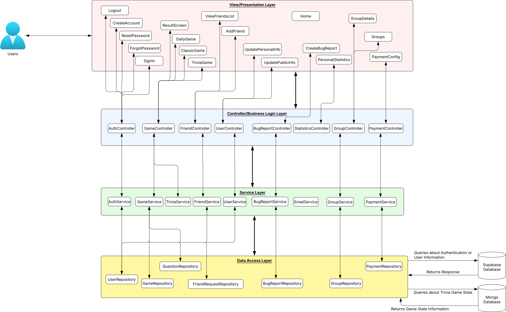

# Qurio

Qurio is a web application designed to allow users to play daily or classic trivia games individually or against friends. Qurio is intended for anyone who wants to continue to learn and challenge their knowledge with new categories and questions. The system will allow for user registration, play daily trivia, play classical trivia, add friends, and have in game currency. Users will be able to add friends to create a competition in who knows a category better. The in-game currency can be earned by playing trivia games or by purchasing the currency via credit card. It makes use of making use of React and Tailwind CSS for the front end and Flask for the backend with Supabase and MangoDB integrations.
---

---

This project combines the MVC architecture with the N-Tier/Layered architecture by organizing the components into four distinct layers. It seperates responsibilities into respective layers with arrows to indicate communication. Communication between layers follows a top-down request flow and bottom-up response flow. The layered structure enforces that each layer only communicates with the layer directly above or below itself. The MVC structure is demonstrated in how the React frontend pages function as View, the Flask controllers act as Controllers, and the model/service/repository classes combined make up the Model segment. By combining these two architectures, Qurio is  easier to organize, maintain, and scale.

## (Layer 1) View/Presentation Layer

This is the layer that the user interacts with; it contains all the views/pages, each responsible for displaying respctive visuals. When the user interacts with the pages, it forwards requests to the layer 2 to fulfill any actions requested of the first layer by the user. Following any requests send to layer 2, the HTTP repsonse is parsed and any necessary information is displayed to the user.

## (Layer 2) Controller Layer/Business Logic Layer

This layer receives HTTP requests from layer 1/Presentation layer, processes any data passed with the request and subsequently for the processed data to layer 3 to handle the business logic. After layer 2 has received the response from layer 3, a jsonified response is returned to layer 1.

## (Layer 3) Service Layer

This layer handles calls from the controller layer, taking in the formatted data and performing the needed action. If extra data is required, the fourth layer is contacted to retrieve that information from the database. Once the required actions have been completed, the service layer returns any updated information required by the frontend too inform the user of any changes.

## (Layer 4) Data Access Layer

This is the layer that the databases interact with either Supabase or MongoDB. Layer 3 will request for layer 4 to do a specific action with the databases. Layer 4 will query Supabase about all user authentication and or user personal information, including name, username, email, and statistics. Layer 4 will query MongoDB when a user plays a classic or daily trivia game. All trivia questions, correct answers, and incorrect answers are saved in MongoDB. Either database will return data in as a response to each query in the proper format to layer 3.

## Example Flow for User Playing a Trivia Game:
1. A user opens the TriviaGame Page in the (Layer 1) View/Presentation Layer
2. The TriviaGame component sends an API request to the GameController in (Layer 2) Controller/Business Logic Layer asking for trivia questions
3. GameController processes the request and calls services such as GameService in (Layer 3) Service Layer
4. The service uses the QuestionRepository in the (Layer 4) Data Access Layer to query the MongoDB database for trivia questions
5. MongoDB returns the requested trivia question data to QuestionRepository
6. QuestionRepository passes the data back to the (Layer 3) Service Layer
7. The service returns the processed result to the GameController in (Layer 2) Controller/Business Logic Layer
8. GameController sends a JSON HTTP response back to the TriviaGame page in (Layer 1) View/Presentation
9. The TriviaGame page displays the trivia question to the user
